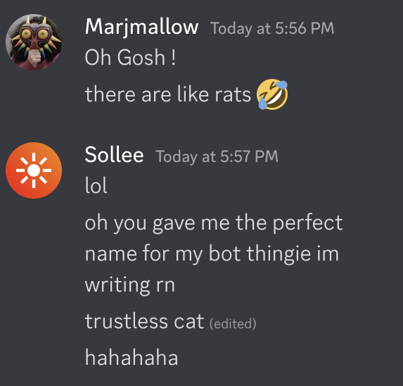

# trustless cat

made for https://trustless.fi. looks at new joiners, scans them for susness

## sus checks

1. new account (<7 days) (+1 point)
2. has the word "trustless" in username (+2 points)
3. has the words "admin", "support", "help", "mod", "operator", "giveaway", "finance", "trading", "community", "official", "announcement", "robot", "news" or "DAO" in username (+1 point)
4. if >=1 points, report to mods
5. if >=3 points, instaban

## normalizing names

scammers are asshole rats who use the magic of unicode to do their evil and bypass simple filters.

we use homoglyph-search to check within 𝕥𝕙𝕖𝕤𝕖 𝖈𝖔𝖔𝖑 𝙨𝙮𝙢𝙗𝙤𝙡𝙨 for particular phrases.

## bring down the hammer

fuck scammers.

# 🔨 mew

##### boring legal stuffs

licensed under GPL 3.0, copyright (c) sollee
